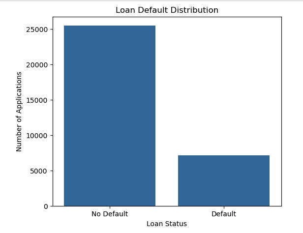
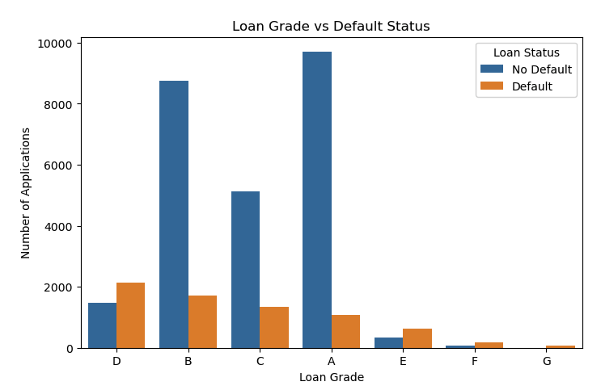
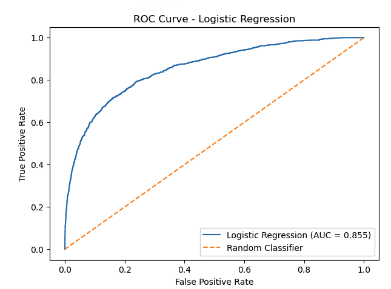
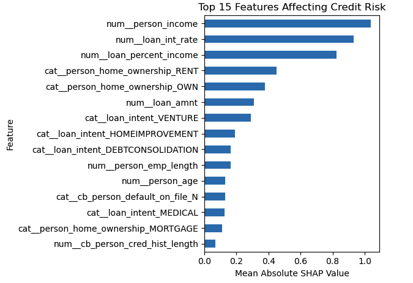

# 💳 Credit Risk Prediction using Machine Learning

An end-to-end Machine Learning project that predicts the likelihood of loan default using applicant and loan-related information.

The project uses **XGBoost** as the final machine learning model and **SHAP** for model explainability. A **Streamlit web application** allows users to enter applicant information and receive a credit-risk prediction along with the top factors influencing the prediction.

---

## 📌 Project Overview

Credit risk prediction is an important application of machine learning in the financial sector. The goal of this project is to predict whether a loan applicant is likely to **default on a loan** based on demographic, financial, employment, and loan-related information.

The project follows a complete ML workflow:

```text
Data Collection
      ↓
Data Exploration
      ↓
Data Cleaning
      ↓
Feature Engineering
      ↓
Data Preprocessing
      ↓
Model Training
      ↓
Model Comparison
      ↓
XGBoost Hyperparameter Tuning
      ↓
Model Evaluation
      ↓
SHAP Explainability
      ↓
Streamlit Application
```

---

## 🎯 Problem Statement

Financial institutions need to assess the credit risk of applicants before approving loans.

The objective of this project is to build a binary classification model that predicts:

* **0 → Loan is not likely to default**
* **1 → Loan is likely to default**

The model can help demonstrate how machine learning can be applied to automate and support credit-risk assessment.

---

## 📊 Dataset

The project uses the **Credit Risk Dataset**, containing **32,581 records** and originally 12 columns.

The original dataset contains applicant information, loan information, and the target variable.

### Final features used for training

The `loan_grade` feature was removed from the final model, and `loan_status` was used as the target variable.

Therefore, the final model uses **10 input features**:

| Feature                      | Description                           |
| ---------------------------- | ------------------------------------- |
| `person_age`                 | Age of the applicant                  |
| `person_income`              | Annual income of the applicant        |
| `person_home_ownership`      | Home ownership status                 |
| `person_emp_length`          | Employment length in years            |
| `loan_intent`                | Purpose of the loan                   |
| `loan_amnt`                  | Requested loan amount                 |
| `loan_int_rate`              | Loan interest rate                    |
| `loan_percent_income`        | Loan amount as a percentage of income |
| `cb_person_default_on_file`  | Previous default history              |
| `cb_person_cred_hist_length` | Length of credit history              |

### Target Variable

```text
loan_status
```

| Value | Meaning    |
| ----: | ---------- |
|   `0` | No Default |
|   `1` | Default    |

---

## 🔎 Exploratory Data Analysis

Several visualizations were created to understand the dataset and model behavior.

### Loan Default Distribution



This visualization shows the distribution between applicants who defaulted and those who did not.

### Loan Grade and Default Analysis



This visualization was used during exploratory data analysis to understand the relationship between loan grade and default status.

> Note: `loan_grade` was not included in the final trained model.

---

## 🧹 Data Preprocessing

The following preprocessing steps were performed:

### Numerical Features

* Missing values were handled using **median imputation**.
* Numerical features were standardized where required.

### Categorical Features

Categorical variables were converted into numerical representations using **One-Hot Encoding**.

### Preprocessing Pipeline

A Scikit-learn preprocessing pipeline was used to keep preprocessing consistent between:

* Training
* Testing
* Streamlit predictions
* SHAP explanations

This helps prevent inconsistencies between the training and production prediction process.

---

## ⚙️ Feature Engineering

The `loan_percent_income` feature represents the proportion of the applicant's income required for the loan.

It is calculated as:

```text
loan_percent_income = loan_amnt / person_income
```

In the Streamlit application, this value is calculated automatically instead of requiring the user to enter it manually.

---

## 🤖 Machine Learning Models

Multiple classification algorithms were tested to compare their performance.

The models included:

* Logistic Regression
* Decision Tree
* Random Forest
* Balanced Random Forest
* XGBoost

The final model was selected based on its overall performance, particularly **ROC-AUC, precision, recall, and F1-score**.

---

## 🚀 XGBoost Model

XGBoost (Extreme Gradient Boosting) was selected as the final model.

XGBoost is an ensemble learning algorithm based on gradient-boosted decision trees. It builds trees sequentially, with each new tree attempting to improve the errors made by previous trees.

### Hyperparameter Tuning

Hyperparameter tuning was performed using cross-validation.

The final tuned parameters were:

```python
{
    "subsample": 1.0,
    "n_estimators": 200,
    "min_child_weight": 5,
    "max_depth": 5,
    "learning_rate": 0.2,
    "colsample_bytree": 1.0
}
```

The model was tuned using **3-fold cross-validation** across multiple parameter combinations.

---

## 📈 Model Performance

The final tuned XGBoost model achieved the following results on the test dataset:

| Metric    |      Score |
| --------- | ---------: |
| Accuracy  | **92.71%** |
| Precision | **94.46%** |
| Recall    | **70.75%** |
| F1 Score  | **80.90%** |
| ROC-AUC   | **94.81%** |

### Why ROC-AUC?

ROC-AUC was used as an important evaluation metric because this is a binary classification problem with an imbalanced target distribution.

A higher ROC-AUC indicates that the model is better at distinguishing between default and non-default cases across different classification thresholds.

---

## 📊 Confusion Matrix

The final tuned XGBoost model produced the following confusion matrix on the test set:

```text
                    Predicted
                 No Default  Default

Actual No Default    5036       59
Actual Default        416     1006
```

This means:

* **5036** → Correctly predicted non-default cases
* **1006** → Correctly predicted default cases
* **59** → False positives
* **416** → False negatives

The false-negative cases are particularly important in credit-risk applications because they represent applicants who actually defaulted but were predicted as non-default.

---

## 📉 ROC Curve

The project also includes ROC curve analysis for model evaluation.



The ROC curve helps visualize the trade-off between the true-positive rate and false-positive rate at different classification thresholds.

---

## 🔍 Feature Importance

Feature importance was analyzed to understand which variables had a strong influence on the model.



Important features identified during model analysis include:

* Person Income
* Loan Interest Rate
* Loan Percent of Income
* Home Ownership
* Loan Amount
* Loan Intent
* Employment Length
* Person Age
* Previous Default History
* Credit History Length

Feature importance provides a **global view** of which features are influential across the model.

---

## 🧠 SHAP Explainability

To make individual predictions easier to understand, **SHAP (SHapley Additive exPlanations)** was integrated into the project.

SHAP explains how individual features contribute to a specific prediction.

For example, instead of displaying only:

```text
High Credit Risk
```

the application can provide explanations such as:

```text
Annual Income increased the predicted risk.
Loan Interest Rate increased the predicted risk.
Employment Length decreased the predicted risk.
```

The Streamlit application displays the **top 5 factors** contributing to the prediction.

This makes the model more interpretable and helps users understand why a particular prediction was made.

---

## 🖥️ Streamlit Application

A Streamlit web application was developed to provide an interactive interface for the trained model.

The user can enter:

* Age
* Annual Income
* Home Ownership
* Employment Length
* Loan Intent
* Loan Amount
* Interest Rate
* Previous Default History
* Credit History Length

The application automatically calculates:

```text
Loan % of Income
```

and sends the input through the same preprocessing pipeline used during model training.

### Application Output

The application displays:

* Predicted credit risk
* Default probability
* High/Low risk classification
* Top 5 factors affecting the prediction
* Information about the training dataset
* Model performance information

---

## 🛡️ Input Validation

The Streamlit application includes validation to prevent invalid inputs.

Examples include:

* Age must be greater than zero.
* Income must be greater than zero.
* Loan amount must be valid.
* Loan percentage of income is calculated only when valid income and loan values are available.

This prevents invalid inputs from causing prediction errors.

---

## 📁 Project Structure

```text
Credit_Risk_Prediction/
│
├── app.py
├── train_model.py
├── shap_explanation.py
├── requirements.txt
├── README.md
│
├── data/
│   └── credit_risk_dataset.csv
│
├── models/
│   └── credit_risk_xgboost.pkl
│
└── images/
    ├── Loan_default_distribution.png
    ├── Loan_grade_default_State.png
    ├── Roc_curve_logisticRegression.png
    ├── confusionMatrix_logisticRegression.png
    ├── confusionMatrix_xgBoost.png
    ├── top15important_randomforest.png
    └── top15featureAffectingCreditRisk.png
```

---

## ▶️ How to Run the Project

### 1. Clone the Repository

```bash
git clone <your-github-repository-url>
```

### 2. Navigate to the Project

```bash
cd Credit_Risk_Prediction
```

### 3. Create a Virtual Environment

```bash
python -m venv venv
```

### 4. Activate the Environment

#### macOS / Linux

```bash
source venv/bin/activate
```

#### Windows

```bash
venv\Scripts\activate
```

### 5. Install Dependencies

```bash
pip install -r requirements.txt
```

### 6. Run the Streamlit Application

```bash
streamlit run app.py
```

The application will open in your browser.

---

## 🧰 Technologies Used

### Programming Language

* Python

### Machine Learning

* Scikit-learn
* XGBoost

### Explainable AI

* SHAP

### Data Processing

* Pandas
* NumPy

### Visualization

* Matplotlib
* Seaborn

### Web Application

* Streamlit

### Model Persistence

* Joblib

### Development Tools

* Git
* GitHub

---

## 💡 Key Learnings

Through this project, I gained practical experience with:

* Data cleaning and preprocessing
* Handling missing values
* Categorical feature encoding
* Feature engineering
* Imbalanced classification
* Logistic Regression
* Decision Trees
* Random Forest
* XGBoost
* Hyperparameter tuning
* Cross-validation
* Model evaluation
* ROC-AUC analysis
* Confusion matrices
* Feature importance
* SHAP explainability
* Model serialization using Joblib
* Building ML applications with Streamlit
* Integrating a trained ML pipeline into a web application

---

## 🔮 Future Improvements

Possible improvements include:

* Deploy the application to a cloud platform
* Add probability-threshold tuning based on business requirements
* Add more advanced model monitoring
* Implement data drift detection
* Experiment with LightGBM and other boosting algorithms
* Add automated model retraining
* Improve SHAP visualizations
* Add authentication and role-based access
* Build an API using FastAPI for production model serving

---

## 👨‍💻 Author

**Deep Patel**

Machine Learning | Python | XGBoost | Azure | DevOps

---
